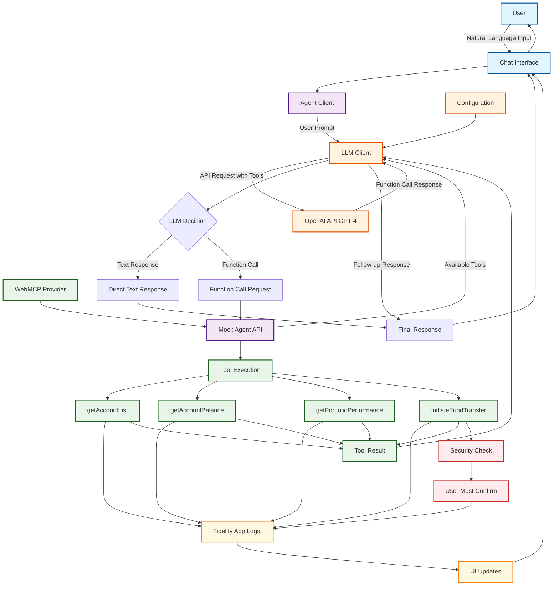

# WebMCP POC - Complete Architectural Flow

This diagram illustrates the complete end-to-end process of how the WebMCP (Web Model Context Protocol) Proof of Concept works, from user input to final response. 

**Note:** The system includes comprehensive console logging at every step, making it an excellent technical demonstration of the WebMCP workflow. Open your browser's Developer Console to see the complete technical narrative during interactions.

