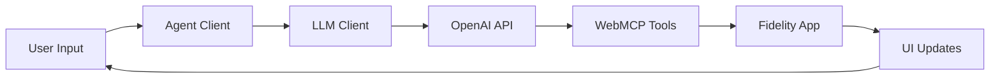

# WebMCP Proof of Concept 🤖💼

A working demonstration of the **Web Model Context Protocol (WebMCP)** - enabling AI agents to interact with web applications through standardized JavaScript tools.

## 🎯 What is This?

This repository contains a fully functional Proof of Concept that demonstrates how the [proposed WebMCP specification](https://github.com/webmachinelearning/webmcp) could work in practice. The POC simulates a **Fidelity Investments** financial dashboard where users can interact with an AI assistant to perform financial tasks through natural language.

### Key Features

- 🧠 **Real LLM Integration** - Uses OpenAI GPT-4 for natural language processing
- 🔧 **WebMCP Tool System** - Implements the official WebMCP API specification
- 🏦 **Financial Use Case** - Realistic Fidelity.com simulation with accounts and transfers
- 🔒 **Security-First** - User confirmation required for sensitive operations
- 🎨 **Professional UI** - Fidelity-branded interface with real-time updates
- 📱 **Browser-Native** - Pure JavaScript implementation, no backend required

## 🚀 Quick Start

### Prerequisites

- **OpenAI API key** (required) - Get one from [OpenAI's platform](https://platform.openai.com/api-keys)
- Python 3.x (for local server)
- Modern web browser

### Setup & Run

1. **Clone and Navigate**
   ```bash
   git clone https://github.com/your-username/webmcp-poc.git
   cd webmcp-poc
   ```

2. **Configure API Key** ⚠️ **REQUIRED**
   
   Edit `js/config.js` and add your OpenAI API key:
   ```javascript
   llm: {
       provider: 'openai',
       apiKey: 'sk-your-api-key-here',  // Replace with your actual OpenAI API key
       model: 'gpt-4-turbo-preview'
   }
   ```
   
   **⚠️ Important**: This POC requires a valid OpenAI API key to function. You can obtain one from [OpenAI's API platform](https://platform.openai.com/api-keys).

3. **Start Local Server**
   ```bash
   python3 -m http.server 8000
   ```

4. **Open in Browser**
   
   Navigate to: `http://localhost:8000`

5. **Try Natural Language Commands**
   - *"What's my Roth IRA balance?"*
   - *"Transfer $5000 from Brokerage to Roth IRA"*
   - *"Show me 3-year performance"*
   - *"List all my accounts"*

## 🏗️ Architecture

### Core Components

```
├── index.html              # Main application interface
├── css/styles.css         # Fidelity-branded styling
└── js/
    ├── config.js          # LLM API configuration
    ├── llmClient.js       # OpenAI integration
    ├── agentClient.js     # Chat UI and orchestration  
    ├── webmcpProvider.js  # WebMCP tool definitions
    ├── fidelityApp.js     # Mock Fidelity application
    └── main.js            # Mock WebMCP browser API
```

### WebMCP Tools Available

1. **`getAccountList`** - Retrieve all user accounts
2. **`getAccountBalance`** - Get specific account balance
3. **`getPortfolioPerformance`** - Display performance charts
4. **`initiateFundTransfer`** - Prepare fund transfers (requires confirmation)

### Communication Flow



## 📚 Documentation

- **[Architecture Diagram](ARCHITECTURE_DIAGRAM.md)** - Visual flow of the entire system
- **[Technical Documentation](TECHNICAL_FLOW_DOCUMENTATION.md)** - Detailed code walkthrough
- **[LLM Setup Guide](SETUP_LLM.md)** - Complete configuration instructions

## 🔧 WebMCP Specification Compliance

This POC faithfully implements the [official WebMCP specification](https://github.com/webmachinelearning/webmcp):

### ✅ Implemented Features

- **Tool Registration** - `window.agent.provideContext()` API
- **JSON Schema Validation** - Proper input parameter schemas
- **Async Execution** - Promise-based tool responses
- **Human-in-the-Loop** - User confirmation for sensitive operations
- **Browser Integration** - JavaScript-based tool execution
- **Security Model** - Fine-grained permissions and user control

### API Example

```javascript
// WebMCP Tool Definition (from webmcpProvider.js)
window.agent.provideContext({
    tools: [
        {
            name: "getAccountBalance",
            description: "Gets the current total market value for a specific account",
            inputSchema: {
                type: "object",
                properties: {
                    accountIdentifier: {
                        type: "string", 
                        description: "The name or type of account to query"
                    }
                },
                required: ["accountIdentifier"]
            },
            async execute({ accountIdentifier }) {
                // Tool implementation
                return { success: true, balance: 15430.25 };
            }
        }
    ]
});
```

## 🎭 Demo Scenarios

### Scenario 1: Account Inquiry
```
User: "What's my Roth IRA balance?"
AI: "The balance for Roth IRA is $89,500.75."
[UI highlights the Roth IRA account]
```

### Scenario 2: Fund Transfer
```
User: "Transfer $5000 from my Brokerage to my Roth IRA"
AI: "I've prepared the transfer for you. Please review and click 'Submit' to complete it."
[Transfer modal appears with pre-filled form requiring user confirmation]
```

### Scenario 3: Portfolio Analysis
```
User: "Show me my 3-year portfolio performance"
AI: "Portfolio performance chart is now showing data for '3 Year'."
[Chart updates to display 3-year timeframe]
```

## 🔒 Security Features

- **User Confirmation** - Sensitive operations require explicit approval
- **Input Validation** - All parameters validated against JSON schemas  
- **Audit Logging** - All tool executions logged to browser console
- **API Key Security** - Configuration-based credential management
- **Sandboxed Execution** - Tools run in controlled browser environment

## 🚧 Development Configuration

The application includes development logging options in `config.js`:

```javascript
// In config.js
development: {
    enableMockMode: false, // Set to true only for testing without API calls
    logRequests: true,     // Log API requests to console
    logResponses: true     // Log API responses to console
}
```

**Note**: This POC is designed to showcase real LLM integration. A valid OpenAI API key is required for full functionality.

## 🔍 Technical Flow Monitoring

This POC includes **comprehensive console logging** that provides a complete technical narrative of the WebMCP workflow. Open your browser's Developer Console to see:

- 🚀 **Application Startup** - WebMCP API simulation and tool registration
- 💬 **User Interaction Flow** - Input processing and UI state management  
- 🤖 **AI Processing** - OpenAI API calls and function calling decisions
- ⚡ **WebMCP Tool Execution** - Real-time tool discovery and execution
- 🏦 **UI Manipulation** - Live interface updates and visual feedback
- ✅ **Response Completion** - Final result processing and user presentation

Each log entry uses emojis and clear prefixes (e.g., `[WebMCP Provider]`, `[LLM Client]`) to make it easy to follow the complete technical flow from user input to final response.

## 🌟 Why This Matters

### For Users
- **Natural Interaction** - Speak to web apps in plain English
- **Faster Workflows** - Complete complex tasks through conversation
- **Maintained Control** - Always see and approve what's happening

### For Developers  
- **Easy Integration** - Leverage existing JavaScript code
- **No Backend Required** - Frontend-only implementation
- **Standards-Based** - Compatible with emerging WebMCP specification

### For the Web Platform
- **Agent-Ready Web** - Prepare for the future of AI-web interaction
- **Developer Adoption** - Simple path to AI integration
- **User Privacy** - Client-side execution, no data sharing required

## 🔮 Future Possibilities

This POC demonstrates the foundation for:

- **Cross-Site Workflows** - AI agents working across multiple websites
- **Voice Interfaces** - Speech-to-text integration for hands-free operation  
- **Accessibility Tools** - Enhanced interfaces for users with disabilities
- **Enterprise Integration** - Corporate applications with AI assistance
- **Mobile Experiences** - Touch-optimized conversational interfaces

## 📊 Technical Highlights

- **Real-Time LLM Integration** - Live OpenAI GPT-4 function calling
- **Mock Browser API** - Complete WebMCP simulation without browser support
- **Production Patterns** - Error handling, loading states, user feedback
- **Modular Architecture** - Clean separation of concerns
- **Standards Compliance** - Follows proposed W3C WebMCP specification
- **Comprehensive Logging** - Detailed console output showing complete technical flow

## 🤝 Contributing

This is a demonstration repository showcasing WebMCP capabilities. For the official WebMCP specification and development:

- **Official Spec**: [W3C WebMCP Repository](https://github.com/webmachinelearning/webmcp)
- **Community Group**: [Web Machine Learning CG](https://www.w3.org/community/webmachinelearning/)

## � Deployment & Sharing

### GitHub Setup

This repository is ready to push to GitHub:

```bash
# Create a new repository on GitHub first, then:
git remote add origin https://github.com/your-username/webmcp-poc.git
git branch -M main
git push -u origin main
```

### Security Notes

- ✅ **API keys are protected** - `.gitignore` prevents committing sensitive data
- ✅ **Placeholder configuration** - `config.js` contains safe placeholder values
- ✅ **Documentation complete** - All setup instructions included

### Sharing with Others

Users who clone this repository will need to:
1. Add their own OpenAI API key to `js/config.js`
2. Start a local server: `python3 -m http.server 8000`
3. Open `http://localhost:8000` in their browser

## �📄 License

This project is a proof of concept for demonstration purposes. See the [official WebMCP repository](https://github.com/webmachinelearning/webmcp) for specification licensing.

---

**Built with ❤️ to demonstrate the future of human-AI collaboration on the web.**